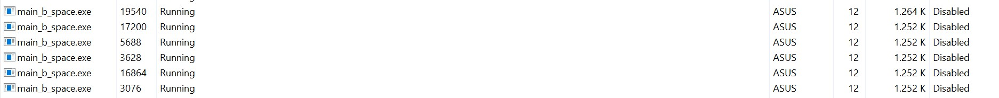

# Matrix Vector Multiplication
* Nim : 2602109870
* Name: Tirza Gabriella
* B26 L1AC

## Table of contents
* [main_test.c](#main_test.c)
* [To Run](#To_Run)
* [Output](#Output)

## main_test.c
```
#include <stdio.h>
#include <stdlib.h>
#include <assert.h>


#define LOWER 1
#define UPPER 5

#include "mylib/mylib.h"

void test_multiply_vector_matrix(int *Matrix, int *Vector, int N, int *vector_expected)
{
  int *vector_result = (int*)malloc(N * sizeof(int));

  if (vector_result == NULL)
  {
    printf("Malloc is failed!\n");
    return;
  }
  
  matVecMult(Matrix, Vector, vector_result, N);

  /*
    the code to compare the result of the multiply 
    vector matrix function and the expected result
  */

  int i;
  for (i = 0; i < N; i++)
  {
    printf("Actual V[%d] = %-2d; Expected V[%d] = %-2d\n", i, vector_result[i], i, vector_expected[i]);
    assert(vector_result[i] == vector_expected[i]);
  }
}

int generateRandomInt(int lower, int upper){
    return (rand() % (upper-lower+1)) + lower;
}

void initMat(int* Matrix, int N){
    for(int i=0; i<N; i++){
        for(int j=0; j<N; j++){
            Matrix[N*i+j] = generateRandomInt(LOWER,UPPER);
        }
    }
}

void initVec(int* Vector, int N){
    for(int i=0; i<N; i++){
        Vector[i] = generateRandomInt(LOWER,UPPER);
    }
}

int main()
{
  int Total_test_cases = 3;
  int N = 2;

  int matrix_input_test_case[3][4] = {
    {2, 3, 4, 1},
    {3, 4, 1, 3},
    {4, 1, 6, 5},
  };

  int vector_input_test_case[3][2] = {
    {0, 0},
    {1, 2},
    {4, 1},
  };

  int vector_expected_test_case[3][2] = {
    {0, 0},
    {11, 7},
    {17, 29},
  };


  int i;
  for (i = 0; i < Total_test_cases; i++)
  {
    printf("Test #%d:\n", i + 1);
    test_multiply_vector_matrix(
      matrix_input_test_case[i],
      vector_input_test_case[i],
      N,
      vector_expected_test_case[i]
    );
    printf("\n");
  }

  return 0;
}
```

## To run:
```
make
./main.exe
```

## Output:
```
Test #1:
Actual V[0] = 0 ; Expected V[0] = 0
Actual V[1] = 0 ; Expected V[1] = 0 

Test #2:
Actual V[0] = 11; Expected V[0] = 11
Actual V[1] = 7 ; Expected V[1] = 7

Test #3:
Actual V[0] = 17; Expected V[0] = 17
Actual V[1] = 29; Expected V[1] = 29
```

# Benchmark (Time Complexity)

## Table of contents
* [Time Complexity](#Time_Complexity )
* [To Run](#To_Run)
* [Output](#Output)

## Time Complexity:
```
#include <stdio.h>
#include <stdlib.h>
#include <time.h>

#include "mylib/mylib.h"

#define LOWER 1
#define UPPER 5

int generateRandomInt(int lower, int upper){
    return (rand() % (upper-lower+1)) + lower;
}

void initMat(int* Matrix, int N){
    for(int i=0; i<N; i++){
        for(int j=0; j<N; j++){
            Matrix[N*i+j] = generateRandomInt(LOWER,UPPER);
        }
    }
}

void initVec(int* Vector, int N){
    for(int i=0; i<N; i++){
        Vector[i] = generateRandomInt(LOWER,UPPER);
    }
}

int main (void) {

    srand(time(0));

    int N = 10000;
    int* Matrix = (int *) malloc(N*N*sizeof(int));
    int* Vector = (int *) malloc(N*sizeof(int));
    int* Result = (int *) malloc(N*sizeof(int));

    initMat(Matrix, N);
    initVec(Vector, N);

    float startTime = (float)clock()/CLOCKS_PER_SEC;

        matVecMult(Matrix,Vector,Result,N);
    
    float endTime  = (float)clock()/CLOCKS_PER_SEC;

    printf("Time elapsed: %f ms\n", 1000 * (endTime - startTime));

    return 0;
}
```

## To run:
```
make time
./main_b_time.exe

Time Iterative:
make time
./main_b_time_iterative.exe
```

## Output:
```
Time elapsed: 417.999969 ms
```

# Benchmark (Space Complexity)

## Table of contents
* [Space Complexity](#Space_Complexity)
* [To Run](#To_Run)
* [Output](#Output)

## Space Complexity
```
#include <stdio.h>
#include <stdlib.h>
#include <time.h>

#include "mylib/mylib.h"

#define LOWER 1
#define UPPER 5

int generateRandomInt(int lower, int upper){
    return (rand() % (upper-lower+1)) + lower;
}

void initMat(int* Matrix, int N){
    for(int i=0; i<N; i++){
        for(int j=0; j<N; j++){
            Matrix[N*i+j] = generateRandomInt(LOWER,UPPER);
        }
    }
}

void initVec(int* Vector, int N){
    for(int i=0; i<N; i++){
        Vector[i] = generateRandomInt(LOWER,UPPER);
    }
}

int main(void) {

    int N = 3000;
    int* Matrix = (int *) malloc(N*N*sizeof(int));
    int* Vector = (int *) malloc(N*sizeof(int));
    int* Result = (int *) malloc(N*sizeof(int));

    initMat(Matrix, N);
    printf("Matrix = ");
    initVec(Vector, N);
    printf("Vector = ");

    while (1) {
        matVecMult(Matrix,Vector,Result,N);
        }

    return 0;

    
}
```

## To run:
```
make space
./main_b_space.exe
```
## Output:
it works as follows.


In here i use N = 500, N = 1000, N = 1500, N = 2000, N = 2500, N = 3000. From the image, it can be seen that as the size of the matrix (N) goes higher, the required amount of space will be larger.

